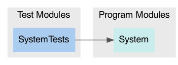

# Package: **System**

## Products

List of products in this package:

| Product | Type | Targets |
| ------- | ---- | ------- |
| System | Library (automatic) | System |

_Libraries denoted 'automatic' can be both static or dynamic._

## Modules

### Program Modules

| Module | Type | Dependencies |
| ------ | ---- | ------------ |
| System | Regular |  |

### Test Modules

| Module | Type | Dependencies |
| ------ | ---- | ------------ |
| SystemTests | Test | System |

### Module Dependency Graph

## External Dependencies

This package has zero dependencies 🎉

## Requirements

### Minimum Required Versions

| Platform | Version |
| -------- | ------- |
| macOS | 10.13 |

This file was generated by [SourceDocs](https://github.com/eneko/SourceDocs) on 2020-05-18 15:00:25 +0000